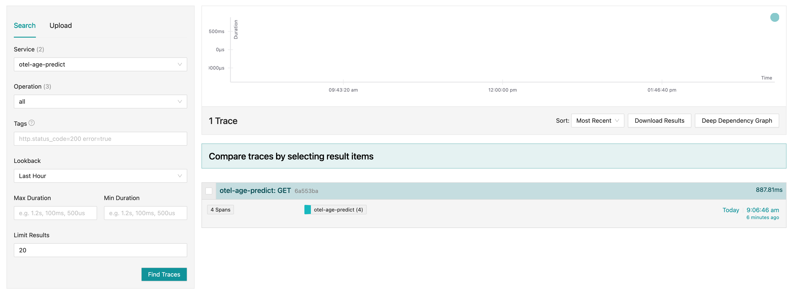
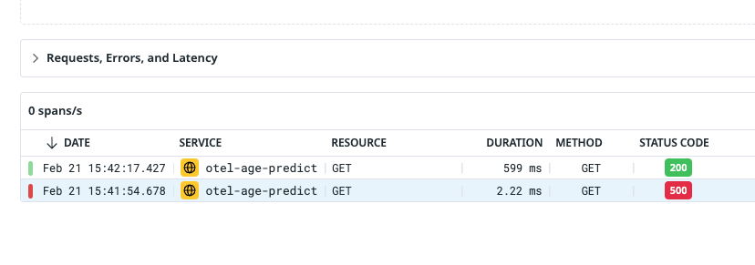

# Open-telemetry example

```bash
# Start up  
yarn docker:dev:up

yarn start:dev:pino
```


Predict someones age from their name 🔮, and take a look at the logs 🪵

You will see the `x-request-id` is propagated through each span's attributes & you'll get an understanding how logs or "Events" are attached to each Span.

```bash
export NAME="thomas"
curl http://localhost:5001/predict\?name\=$NAME -H "x-request-id: 12343" | jq
curl http://localhost:5001/error -H "x-request-id: 12343" | jq
```

You've predicted an age off someones name! And generated a mock error. Now lets take a look at the traces!

Open up the local running [Jaeger](http://localhost:16686/jaeger/ui) in your browser, select a service and hit "Find Traces". Once you've done that you should be able to click into your trace to see the span break down.




I've also proved that this kind of open-telemetry can be used with DataDog you will need to setup an account to use this integration.
I created with a personal account with a 14day trial using a Docker integration for logs & APM.

```bash
# Remove dev containers as ports may conflict
yarn docker:dev:down

# Set Datadog vars
export DD_API_KEY='YOUR_API_KEY'
export DD_SITE="$REGION.datadoghq.com"

# Start up the docker containers
yarn docker:datadog:up
```

Generate some more traces
```bash
export NAME="john"
curl http://localhost:5001/predict\?name\=$NAME -H "x-request-id: 12343" | jq
curl http://localhost:5001/error -H "x-request-id: 12343" | jq
```

Head over to your DataDog account under `APM`->`Traces`->`otel-age-predict`

